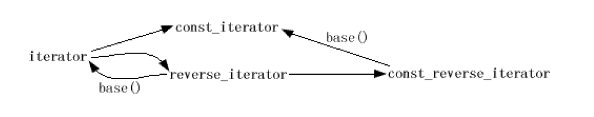

注意：本书出版的年代有些早，因此有些内容已经过时，因此只是起到参考的作用。

## 条款1：仔细选择你的容器

stl的指导方案：默认可以使用vector，当很频繁的在序列中部进行插入和删除时应该使用list，当大部分插入和删除发生在序列的头或尾时可以选择deque。

标准的连续内存容器是vector、string和deque，非标准的rope也是连续内存容器。表现为链表的容器例如list和slist是基于节点的，所有的标准关联容器也是（它们的典型实现是平衡树）。有以下的指导建议：

- 是否需要在容器的任意位置插入新元素的能力，若是，选择序列容器，关联容器做不到；
- 关心元素在容器的顺序吗？若不关心，散列容器可选择，否则要避免使用；
- 必须使用标准C++容器吗？若是除去散列容器、slist和rope；
- 需要哪类的迭代器，若是随机访问迭代器只能选择vector、deque和string，也可考虑rope，若是双向迭代器，那就用不了slist和散列容器的一般实现；
- 插入或删除数据时是否在意容器内现有元素的移动，若是，就必须放弃连续内存容器；
- 容器中的数据内存布局是否要兼容C，若是就只能用vector；
- 查找速度重要吗？若是应该按以下的顺序选择，散列容器、排序的vector和标准关联容器；
- 介意容器使用引用计数吗？若是则避免使用string和rope；
- 需要插入和删除的事务性语义吗？即能够回退插入和删除，若是就应该使用基于节点的容器，如果需要多元素插入的事务性语义，应该选择list；
- 需要把迭代器、指针和引用的失效次数减少到最少吗？若是应该使用基于节点的容器；
- 需要可以使用随机访问迭代器，只要没有删除且插入只发生在容器结尾，指针和引入的数据不会失效的容器，那么选择deque（插入发生在容器结尾时，deque的迭代器也可能失效，但迭代器失效不会使它的指针和引用失效）。

## 条款2：小心对”容器无关代码“的幻想

stl是建立在泛化的基础之上，数组泛化为容器，参数化了所包含的对象的类型，函数泛化为算法，参数化了所有迭代器的类型，指针泛化成了迭代器，参数化了所指向的对象的类型；独立的容器类型泛化为序列或关联容器，类似的容器都拥有类似的功能，例如标准的内存相邻容器都提供随机访问迭代器，标准的基于节点的容器都提供双向迭代器，序列容器支持push_front或push_back，但关联容器不支持，关联容器提供对数时间复杂度的Lower_bound、upper_bound和equal_range成员函数但序列容器没有。

虽然泛化很方便，但不建议脱离容器去泛化，比如现在可以用vector，但以后可以用deque或list等，因为每种容器的实现机制都不一样。虽然我们一次次的改变容器，但仍旧有简化的方法，其中最简单的是对容器和迭代器类型使用typedef，不要这么写：

```c++
class Widget{...};
vector<Widget> vw;
Widget bestWidget;
...
vector<Widget>::iterator i = find(vw.begin(), vw.end(), bestWidget);
```

而可以这样修改：

```c++
class Widget{...};
typedef vector<Widget> WidgetContainer;
typedef WidgetContainer::iterator WCIterator;
WidgetContainer cw;
Widget bestWidget;
...
WCIterator i = find(cw.begin(), cw.end(), bestWidget);
```

现在我们想要改变容器类型就简单许多。

typedef只是其他类型的同义字，所有其提供的封装是纯的语法（不要#define是在预编译阶段进行替换）。如果不想暴露所使用的容器类型，可以使用class增加私密性。比如我们建立一个CustomerList类，将list隐藏在它的private区域：

```c++
class CustomerList {
private:
    typedef list<Customer> CustomerContainer;
    typedef CustomerContainer::iterator CCIterator;
    CustomerContainer customers;
public: // 通过这个接口
    ... // 限制list特殊信息的可见性
};
```

而且这样操作带来的好处就是封装性很好，假设我们需要更换容器，那么客户基本没啥影响。

## 条款3：使容器里对象的拷贝操作轻量而正确

我们在容器里的存取操作，其实是一种拷进来拷出去的操作。然而，如果元素非常大，那么拷贝就会浪费性能，这还是其次，如果涉及到继承，例如把派生类对象插入基类对象的容器中，很可能会出错。

一种避免以上问题的方法是容器中存储指针，但指针的容器也有它们自己STL相关的头疼问题，因此最好选用只智能指针。

## 条款4：用empty来代替检查size()是否为0

*过时：11已经要求size函数的实现是常数时间*

事实上empty的典型实现是一个返回size是否为0的内联函数，那么为什么推荐使用empty呢，这是因为对于所有的标准容器，empty是一个常数时间的操作，但对于一些list实现，size花费线性时间。注意，对于所有标准容器，只有list提供了不用拷贝数据就能把元素从一个地方接合到另一个地方的能力。

## 条款5：尽量使用区间成员函数代替它们的单元素兄弟

无论何时当必须完全代替一个容器的内容时都应该想到赋值，不要忘记assign。例如如下的实现就较为的高效：

```c++
v1.assign(v2.begin() + v2.size() / 2, v2.end());
```

另外，几乎所有目标区间是通过插入迭代器指定的copy的使用都可以通过调用区间的成员函数来替代，例如：

```c++
v1.clear();
copy(v2.begin() + v2.size() / 2, v2.end(), back_inserter(v1));
//insert替代
v1.insert(v1.end(), v2.begin()+v2.size()/2, v2.end());
```

至于本条准则的原因，有以下的描述：

- 一般来说使用区间成员函数可以输入更少的代码；
- 区间成员函数会导致代码更清晰直接；

另外，还有效率的考量，比如当处理标准序列容器时，应用单元素成员函数比完成同样目的的成员函数需要更多的内存分配，更频繁的拷贝，或造成多余的操作。

一般的成员区间函数有区间构造，区间插入insert，区间删除erase，区间赋值assign。

## 条款6：警惕C++最令人恼怒的解析

*过时：可以用大括号来避免*

例如这样的声明：

```
list<int> data(istream_iterator<int>(dataFile), istream_iteration<int>());

```

一般来说，参数名左右的括号被忽略，但单独的括号指出存在一个参数列表，例如上面第一个参数就是dataFile，而第二个参数就是一个输入参数为空，输出类型为istream_iteration<int>的函数指针。显然第一个参数并不是我们想要的。我们知道，用括号包围一个实参的声明是不合法的，但用括号包围一个函数调用是合法的，因此可以如下修改：

```c++
list<int> data((istream_iterator<int>(dataFile)), // 注意在list构造函数
istream_iterator<int>()); // 的第一个实参左右的
// 新括号
```

这样会强迫编译器将其理解成函数调用，也就达到了我们的目的，但并非所有的编译器都吃这一套，所以我们可以如下的修改：

```c++
ifstream dataFile("ints.dat");
istream_iterator<int> dataBegin(dataFile);
istream_iterator<int> dataEnd;
list<int> data(dataBegin, dataEnd);
```

## 条款7：当使用new得指针的容器时，记得在销毁容器前delete那些指针

当容器存储了元素的指针时，直接释放容器必然会导致内存泄漏，因为指针的“析构函数”是误操作的，其必然不会调用delete。可以如下操作：

```c++
template<typename T>
struct DeleteObject : // 条款40描述了为什么
public unary_function<const T*, void> { // 这里有这个继承
    void operator()(const T* ptr) const
    {
    	delete ptr;
    }
};
```

现在可以如下处理：

```c++
void doSomething()
{
... // 同上
    for_each(vwp.begin(), vwp.end(), DeleteObject<Widget>);
}
```

但这样暴露了我们要删除的是widget类型，一旦弄错了就会出现bug。例如我们知道，所有标准STL容器都确实虚析构函数，而从没有虚析构函数的类公有继承是C++的一大禁忌，如果我们有需要声明了SpecialString继承了string，那么下面的代码就会有问题：

```c++
void doSomething()
{
    deque<SpecialString*> dssp;
    ...
    for_each(dssp.begin(), dssp.end(), // 行为未定义！通过没有
    DeleteObject<string>()); // 虚析构函数的基类
} // 指针来删除派生对象
```

我们可以通过编译器推断传给DeleteObject::operator()的指针的类型来消除这个错误，例如：

```c++
struct DeleteObject { // 删除这里的
    // 模板化和基类
    template<typename T> // 模板化加在这里
    void operator()(const T* ptr) const
    {
    	delete ptr;
    }
}
```

但这仍旧不是异常安全的，如果在new之后和for_each之前发生异常，就会内存泄漏，一个解决方法是使用智能指针。

## 条款8：永不建立auto_ptr的容器

auto_ptr已废弃

## 条款9：在删除选项中仔细选择

我们需要根据容器选择删除的方法。比如一个连续内存容器，最好的方法是erase-remove方法，我们现在要删除c中所有值为1936的对象：

```c++
c.erase(remove(c.begin(), c.end(), 1936), c.end()); //当c是vector、string或deque时，erase-remove是惯用删除特定值的方法
```

这种方法也适合list，但list的成员函数remove更高效：

```c++
c.remove(1936);
```

当c是关联容器时就不能使用remove，因为没有，我们可以使用erase，如下：

```c++
c.erase(1936); //当c是标准关联容器时，erase成员函数是去除特定值元素的最佳方法。
```

如果在这种情况下还需要满足某种条件，那对于标准序列容器可以使用remove_if，例如：

```c++
c.erase(remove_if(c.begin(), c.end(), badValue), c.end());
```

对标准关联容器，有以下两种办法，一个更容易编码，一个更高效，容易编码的方案是用remove_copy_if把我们需要的值拷贝到新的容器，然后把原容器的内容与之做交换，如下：

```c++
AssocContainer<int> c; // c现在是一种
... // 标准关联容器
AssocContainer<int> goodValues; // 用于容纳不删除
// 的值的临时容器
remove_copy_if(c.begin(), c.end(), // 从c拷贝不删除
inserter(goodValues, // 的值到
goodValues.end()), // goodValues
badValue);
c.swap(goodValues); // 交换c和goodValues
```

这种方法的缺点是拷贝了所有不删除的元素，存在开销。

我们还可以这样做：

```c++
AssocContainer<int> c;
...
for (AssocContainer<int>::iterator i = c.begin(); // 清晰，直截了当
i!= c.end(); // 而漏洞百出的用于
++i) { // 删除c中badValue返回真
	if (badValue(*i)) c.erase(i); // 的每个元素的代码
} // 不要这么做！
```

这样会造成迭代器失效，也不可取，修改如下：

```c++
AssocContainer<int> c;
...
for (AssocContainer<int>::iterator i = c.begin(); // for循环的第三部分
i != c.end(); // 是空的；i现在在下面
/*nothing*/ ){ // 自增
    if (badValue(*i)) c.erase(i++); // 对于坏的值，把当前的
    else ++i; // i传给erase，然后
} // 作为副作用增加i；
// 对于好的值，
// 只增加i
```

这样不适合序列容器，因此对vector、string和deque采取如下修改：

```c++
for (SeqContainer<int>::iterator i = c.begin();
i != c.end();){
	if (badValue(*i)){
        logFile << "Erasing " << *i << '\n';
        i = c.erase(i); // 通过把erase的返回值
    } // 赋给i来保持i有效
    else
    	++i;
}
```

经过以上讨论，有如下的结论：

- 去除一个容器中有特定值的所有对象：

  如果容器是vector、string和deque，使用erase-remove，如果是list，使用remove，如果是标准关联容器，使用erase成员函数；

- 去除一个容器中满足一个特定判定式的所有对象：如果容器是vector、string、deque，使用erase-remove_if惯常用法，是list则使用remove_if，标准关联容器则用remove_copy_if和swap，或写一个循环来遍历容器元素，记得将迭代器传给erase时后置递增；

- 在循环内做某些事，如果是标准序列，遍历时调用erase记得用返回值更新迭代器，若是标准关联容器，记得将迭代器传给erase时后置递增；

## 条款10：注意分配器的协定和约束

分配器最初被设想为抽象内存模型，这种情况下，分配器在它们定义的内存模型中提供指针和引用的typedef才有意义。在C++标准里，类型T的对象的默认分配器提供typedef allocate<T>::pointer和allocator<T>::reference，而且希望用户定义的分配器也提供这些typedef。然而，C++中没法捏造引用，因为这样做要求有能力重载operator.，而这是不允许的，另外建立行为像引用的对象是使用代理对象的例子，而代理对象会导致很多问题。实际上，标准明确允许库实现假设每个分配器的Pointer typedef是T*的同义词，每个分配器的reference typedef与T&相同，所以库实现忽视typedef并直接使用原始指针和引用。

另外，分配器是对象，那就表明它们可能有成员函数，内嵌的类型和typedef等，但标准允许STL实现认为所有相同类型的分配器对象都是等价且比较总是相等的。

考虑如下的代码：

```c++
template<typename T> // 一个用户定义的分配器
class SpecialAllocator {...}; // 模板
typedef SpecialAllocator<Widget> SAW; // SAW = “SpecialAllocator
// for Widgets”
list<Widget, SAW> L1;
list<Widget, SAW> L2;
...
L1.splice(L1.begin(), L2); // 把L2的节点移到
// L1前端
```

注意到list元素从一个list被接合到另一个时，没有拷贝什么，而是调整了一些指针。当L1被销毁时，它必须销毁它的所有节点，因为它现在包含最初是L2一部分的节点，L1的分配器必须回收最初由L2分配器分配的节点，所以标准允许STL实现认为同类型的分配器等价。这个标准非常严格，意味着可移植的分配器对象不能有状态，即不能有任何非静态数据成员，至少没有会影响它们行为的。

operator new跟allocator<T>::allocate还是有很大程度的不同，首先看函数声明：

```c++
void* operator new(size_t bytes);
pointer allocator<T>::allocate(size_type numObjects);
// 记住事实上“pointer”总是
// T*的typedef
```

operator new指定的是字节数，而分配器指定的是内存容纳多少个T对象，其次是返回对象，new返回void\*，而分配器返回一个T\*，虽然这里T还没有被构造。

考虑list容器，里面可能存储一些节点ListNode，当我们用分配器为它获取内存时，我们要的不是T的内存，而是ListNode的内存，可以这样写：

```c++
template<typename T> // 标准分配器像这样声明，
class allocator { // 但也可以是用户写的
public: // 分配器模板
    template<typename U>
    struct rebind{
    	typedef allocator<U> other;
    }
    ...
};
```

这样，ListNodes的对应分配器类型是Allocator::rebind<ListNode>::other；

下面总结一下内容：

- 将分配器做成模板，带有模板参数T，代表要分配内存的对象类型；
- 提供pointer和reference的typedef，但总是让pointer是T*，reference是T&；
- 绝不要给分配器每对象状态，一般不能有非静态成员；
- 传给分配器的是对象个数，返回的是T*指针；
- 一定要提供标准容器依赖的内嵌rebind模板；

## 条款11：理解自定义分配器的正确用法

现在来自定义分配器解决的方案，假设有仿效malloc和free的程序，用来管理共享内存的堆：

```c++
void* mallocShared(size_t bytesNeeded);
void freeShared(void *ptr);
```

现在希望将STL容器的内容放在共享内存中：

```c++
template<typename T>
class SharedMemoryANocator {
public:
    ...
    pointer allocate(size_type numObiects, const void *localityHint = 0)
    {
    	return static_cast<pointer>(mallocShared(numObiects * sizeof(T)));
    }
    void deallocate(pointer ptrToMemory, size_ type numObjects)
    {
    	freeShared(ptrToMiemory);
    }
    ...
};
```

我们可能会这么做：

```c++
// 方便的typedef
typedef vector<double, SharedMemoryAllocator<double> >
SharedDoubleVec;
...
{ // 开始一个块
    SharedDoubleVec v; // 建立一个元素在
    // 共享内存中的vector
    ... // 结束这个块
}
```

这样做v本身及其内容并不会被放入共享内存，除非像如下的使用：

```c++
void *pVectorMemory = // 分配足够的共享内存
mallocShared(sizeof(SharedDoubleVec)); // 来容纳一个
// SharedDoubleVec对象
SharedDoubleVec *pv = // 使用“placement new”来
new (pVectorMemory) SharedDoubleVec; // 在那块内存中建立
// 一个SharedDoubleVec对象；
// 参见下面
// 这个对象的使用（通过pv）
...
pv->~SharedDoubleVec(); // 销毁共享内存
// 中的对象
freeShared(pVectorMemory); // 销毁原来的
// 共享内存块
```

还可以如下的使用分配器：

```c++
template<typenameT, typename Heap>
class SpecificHeapAllocator {
public:
    pointer allocate(size_type numObjects, const void *localityHint = 0)
    {
        return static_cast<pointer>(Heap::alloc(numObjects * sizeof(T),
        localityHint));
    }
    void deallocate(pointer ptrToMemory, size_type numObjects)
    {
    	Heap::dealloc(ptrToMemory);
    }
    ...
};

vector<int, SpecificHeapAllocator<int, Heap1 > > v; // 把v和s的元素
set<int, SpecificHeapAllocator<int Heap1 > > s; // 放进Heap1
list<Widget,
SpecificHeapAllocator<Widget, Heap2> > L; // 把L和m的元素
map<int, string, less<int>, // 放进Heap2
SpecificHeapAllocator<pair<const int, string>,
Heap2> > m;
```

注意，Heap1和Heap2是对象而不是类，否则就违反了上一章分配器的等价约束。

## 条款12：对STL容器线程安全性的期待现实一些

对于STL容器，一般有如下的说法：

- 多个读取者是安全的，多线程可能同时读取一个容器的内容，但读取时不能有任何写入者操作这个容器；
- 对不同容器的多个写入者是安全的，多线程可以同时写不同的容器；

## 条款13：尽量使用vector和string来代替动态分配的数组

注意的是，有许多string使用了引用计数来改善性能，如果我们不想这样做，尝试使用vector<char>来代替string。

## 条款14：使用reserve来避免不必要的重新分配

对于vector和string，只要需要更多的空间，一般需要以realloc等价的思想来增长：

1. 分配新的内存块，在大部分实现中，vector和string的容量每次以2为因子增长；
2. 把所有元素从容器的旧内存拷贝到新内存；
3. 销毁旧内存中的对象；
4. 回收旧内存；

reserve允许最小化必须进行的重新分配的次数，因而可以避免真分配的开销和迭代器/指针/引用失效。也就是说，最好初始化的时候给与足够的空间。

## 条款15：小心string实现的多样性

有以下的总结：

- 字符串值可能是引用计数或不是，默认情况下很多都是，但可通过预处理器宏关闭；
- string对象的大小可能是从1到7倍指针的大小；
- 新字符串值的建立可能需要0、1或2次的动态分配；
- string对象可能是或可能不共享字符串的大小或容量信息；
- string可能是或可能不支持每对象配置器；
- 不同实现对于最小化字符缓冲区的配置器有不同策略；

## 条款16：如何将vector和string的数据传给遗留的API

一般是为了兼容C风格的API接受的是数组和char*指针，而不是vector对象，如果要从vector对象中得到指向v中数据的指针，可以使用&v[0]，对于string对象s，则使用s.c_str()；

如果想用来自C风格的数据初始化string对象，可以将数据放入一个vector<char>中，然后从vector中将数据拷到string：

```c++
// C API：此函数需要一个指向数组的指针，数组最多有arraySize个char
// 而且会对数组写入数据。它返回写入的char数，不会大于arraySize
size_t fillString(char *pArray, size_t arraySize);
vector<char> vc(maxNumChars); // 建立一个vector，
// 它的大小是maxNumChars
size_t charsWritten = fillString(&vc[0], vc.size()); // 让fillString把数据写入vc
string s(vc.begin(), vc.begin()+charsWritten); // 从vc通过范围构造函数
// 拷贝数据到s（参见条款5）
```

## 条款17：使用“交换技巧”来修整过剩容量

*过时：现在已经有了std::shrink_to_fit*

假设使用contestants来保存元素：

```c++
class Contestant {...};
vector<Contestant> contestants;
```

随着数据结构的更改，vector的内容实际发生了更改，可能里面只有很少的元素，但容量没有减少，为了减少过剩的容量，可以采取以下的技巧：

```c++
vector<Contestant>(contestants).swap(contestants);
```

vector的拷贝构造函数只会分配拷贝元素所需要的内存，后又通过swap函数将两者数据交换，此时contestants的容量已经实际的减少，等到语句结尾，这个临时的vector被销毁。string也可以使用同样的技巧。

## 条款18：避免使用vector<bool>

vector<bool>存在两个问题，第一不是一个STL容器，第二它并不容纳bool。一个东西是STL容器的标准之一必须满足以下的条件合法：

```c++
T* p = &c[0];
```

而vector<bool>并不行，因为它实际使用了比特位来假装保持bool，也就是一个bool会用一个比特位来代表。注意，vector<bool>::operator[]并不返回对实际比特的引用，而是返回了一个对象，类似与比特的引用，也称为代理对象。

虽然不能使用vector<bool>，但可以使用deque<bool>来代替，它是一个STL容器。也可以使用bitset来代替，它不是STL容器，它的大小在编译期间固定，因此不支持插入和删除，也不支持iterator。

## 条款19：了解相等和等价的区别

相等的概念是基于operator==的，如果x==y，那么它们相等，但并不代表它们所有成员的值相等。等价是基于在一个有序区间中对象值的相对位置，一般是在标准关联容器中的排序有意义，也就是如下的表达：

```c++
!(w1<w2)&&!(w2<w1)
```

## 条款20：为指针的关联容器指定比较类型

如果我们的set里存储了string类型的指针，我们又想要按string进行排序，那么必须写自己的比较仿函数类，例如：

```c++
struct StringPtrLess:
	public binary_function<const string*, const string*, bool> {
	bool operator()(const string *ps1, const string *ps2)
	{
		return *ps1 < *ps2;
	}
};
	
```

然后我们如下建立实例：

```c++
typedef set<string*, StringPtrLess> StringPtrSet;
StringPtrSet ssp;
```

## 条款21：永远让比较函数对相等的值返回false

*部分过时：17已经移除了std::binary_function*

若是违反了这条准则，则违反的等价原则。

## 条款22：避免原地修改set和multiset的键

原理很简单，这两种容器是有序的，如果随意修改其值，则破坏了容器的有序性。至于为什么不提map和multimap，则是因为这两种容器元素类型为pair<const K, V>，键的类型不可更改。而set跟multiset元素类型不过是T。

有时候我们完全有理由改变set或multiset元素的非键部分，那么如何保证既正确又可移植，那就是将非键部分映射到一个引用，可以如下做：

```c++
EmpIDSet::iterator i = se.find(selectedID);
if (i!=se.end()) {
	const_cast<Employee&>(*i).setTitle("xxx");
}
```

这将映射到一个引用，不会产生匿名的临时对象，因而达到了改变部分值的效果。以下的方法就不行：

```c++
EmpIDSet::iterator i = se.find(selectedID);
if (i!=se.end()) {
	const_cast<Employee>(*i).setTitle("xxx");
	//或者用c的方法
	((Employee)(*i)).setTile("xxx")
}
```

这两种形同以下的操作：

```c++
if (i!=se.end()) {
	Employee temCopy(*i);
	tempCopy.setTitle("xxx");
}
```

总结以下，要安全的改变set、multiset、map、或者multimap，简单的按以下五个步骤：

1. 定位元素；
2. 拷贝一份要改变的元素；
3. 修改副本，改成自己想要的值；
4. 从容器里删除原来的元素；
5. 把新值插入容器；

## 条款23：考虑用有序vector代替关联容器

在有序vector中存储数据很可能比标准关联容器中保持数据消耗更少的内存，当页面错误值得重视的时候，有序vector通过二分法查找可能比一个标准关联容器要快。使用示例如下：

```c++
vector<Data> vd; // 代替map<string, int>
... // 建立阶段：很多插入，
// 几乎没有查找
sort(vd.begin(), vd.end(), DataCompare()); // 结束建立阶段。（当
// 模拟multimap时，你
// 可能更喜欢用stable_sort
// 来代替；参见条款31。）
string s; // 用于查找的值的对象
... // 开始查找阶段
if (binary_search(vd.begin(), vd.end(), s,
DataCompare()))... // 通过binary_search查找
vector<Data>::iterator i =
lower_bound(vd.begin(), vd.end(), s,
DataCompare()); // 在次通过lower_bound查找，
if (i != vd.end() && !DataCompare()(s, *i))... // 条款45解释了
// “!DataCompare()(s, *i)”测试
pair<vector<Data>::iterator,
vector<Data>::iterator> range =
equal_range(vd.begin(), vd.end(), s,
DataCompare()); // 通过equal_range查找
if (range.first != range.second)...
... // 结束查找阶段，开始
// 重组阶段
sort(vd.begin(), vd.end(), DataCompare()); // 开始新的查找阶段...
```

## 条款24：当关乎效率时应该在map::operator[]和map-insert之间仔细选择

对于map来说，使用operator[]时，如果值没在容器里面则加入新值，否则就对旧值进行更新。其中的原理是operator[]返回一个与k值关联的值对象的引用，因此可以更新值，但如果容器里面没有此值，则会使用值类型的默认构造函数从头建立一个，然后operator[]返回这个新建对象的引用。这样会有性能的降低，一次默认构造，一次销毁这个临时对象还有一次赋值操作，所以为了避免这个消耗可以使用map-insert代替operator[]。但当是更新操作时，使用情况更好相反。

## 条款25：熟悉非标准散列容器

也就是unordered_map、unordered_set之类使用哈希表实现的容器，现在已经纳入到标准容器中。

## 条款26：尽量用iterator代替const_iterator，reverse_iterator和const_reverse_iterator

每个标准容器都提供了iterator、const_iterator、reverse_iterator以及const_reverse_iterator这四种迭代器，但基本上这些标准容器只接受iterator类型的参数。这四种迭代器也有如下的关系，可以进行转换：



注意，无法从const迭代器反过来得到iterator。

简单来说，就是尽量使用iterator代替const或reverse类型的迭代器。另外，当迭代器的类型不同，代码可能编译报错，这种情况可以将iterator转换为const_iterator，如下：

```c++
if(static_cast<ConstIter>(i)-ci>=3)...
```

## 条款27：用distance和advance把const_iterator转化成iterator

如果实在要把const_iterator转化为iterator可以进行如下操作：

```c++
typedef deque<int> IntDeque;
typedef IntDeque::iterator Iter;
typedef IntDeque::const_iterator ConstIter;

IntDeque d;
ConstIter ci;
... 			// 让ci指向d
Iter i(d.begin()); // 初始化i为d.begin()
advance(i, distance(i, ci)); // 把i移到指向ci位置
        // （但请留意下面关于为什么
        // 在它编译前要调整的原因）
```

这种方法就是先让iterator指向容器的起始位置，再将其前移到和const_iterator距离容器起始位置的偏移量一样的位置即可。但这样也不行，因为distance不能同时接受两种不同的类型，改正如下：

```c++
advance(i, distance<ConstIter>(i, ci));
```

对于vector和string、deque的话，转换是常数时间的操作，对于双向迭代器则是线性时间的操作。

## 条款28：了解如何通过reverse_iterator的base得到iterator

有以下的代码：

```c++
vector<int> v;
v.reserve(5); // 参见条款14
for(int i = 0；i < 5; ++ i) { // 向vector插入1到5
v.push_back(i);
}
vector<int>::reverse_iterator ri = // 使ri指向3
find(v.rbegin(), v.rend(), 3);
vector<int>::iterator i(ri.base()); // 使i和ri的base一样
```

则产生的结果如下图所示：


如果要在ri的位置插入新元素，例如插入99，由于ri的遍历顺序是从右向左，则99应该出现在3的右侧，然而insert操作的是iterator，转换成iterator之后插入的位置恰好一致。但删除就需要注意，例如想要删除3，但很可能会误删4的位置，所以此时要进行偏移，如下：

```c++
v.erase(--ri.base());
```

但这样操作对string和vector行不通，因为其iterator会使用内建的指针来实现，然而c跟c++都规定了不能直接修改函数返回的指针，所以一般编不过，所以通用方法如下：

```c++
v.erase((++ri).base());
```

*注意：实际可以编译过，所以上述说法过时*

## 条款29：需要一个一个字符输入时考虑使用istreambuf_iterator

当想要把一个文本文件拷贝到一个字符串对象时，可以这样操作：

```c++
ifstream inputFile("interestingData.txt");
string fileData((istream_iterator<char>(inputFile)), // 把inputFile读入
istream_iterator<char>()); // fileData；关于为什么
// 它不是很正确请看下文
// 关于这个语法的警告
// 参见条款6
```

然而这样做无法拷贝空格，如果要保留空格，则需要清楚输入流的skipws标志：

```c++
ifstream inputFile("interestingData.txt");
inputFile.unset(ios::skipws); // 关闭inputFile的
// 忽略空格标志
string fileData((istream_iterator<char>(inputFile)), istream_iterator<char>());
```

但这样还是很慢，因为依靠的是格式化输入，每次都必须建立和销毁岗哨对象，检查可能影响它们行为的流标志等等，一个更好的方法是使用istreambuf_iterators，其会进入流的缓冲区直接读取下一个字符，改变如下：

```c++
ifstream inputFile("interestingData.txt");
string fileData((istreambuf_iterator<char>(inputFile)),
istreambuf_iterator<char>());
```

## 条款30：确保目标区间足够大

以下的调用存在问题：

```c++
int transmogrify(int x); // 这个函数从x
// 产生一些新值
vector<int> values;
... // 把数据放入values
vector<int> results; // 把transmogrify应用于
transform(values.begin(), values.end(), // values中的每个对象
results.end(), // 把这个返回的values
transmogrify); // 附加到results
// 这段代码有bug！
```

那就是一开始result里面并没有元素，直接插入会出问题，可以采用如下的方式解决：

```c++
transform(values.begin(), value.end(), back_inserter(results), transmogrify);
```

这种方式back_inserter返回的迭代器会调用push_back，类似的，其他情况也可以用front_inserter等。为了提高效率，我们也可以提前使用reserve增加容量。当然，以下也是错误的：

```c++
vector<int> values; // 同上
vector<int> results;
...
results.reserve(results.size() + values.size()); // 同上
transform(values.begin(), values.end(), // 写入transmogrify的结果
results.end(), // 到未初始化的内存
transmogrify); // 行为未定义！
```

## 条款31：了解你的排序选择

partial_sort可以指定区间排序，如下：

```c++
partial_sort(widgets.begin(), widgets.begin()+20, widgets.end(), qualityCompare);
```

如果不注重顺序，只想要前20个元素，可以使用nth_element，如下：

```c++
nth_element(widgets.begin(), widgets.begin()+19, widgets.end(), qualityCompare);
```

当然，上述算法是不稳定的，要想稳定的，可以使用stable_sort。

nth_element也有其他的用处。例如可以用来找中值等等，以下是示例：

```c++
vector<Widget>::iterator begin(widgets.begin()); // 方便地表示widgets的
vector<Widget>::iterator end(widgets.end()); // 起点和终点
// 迭代器的变量
vector<Widget>::iterator goalPosition; // 这个迭代器指示了
// 下面代码要找的
// 中等质量等级的Widget
// 的位置
goalPosition = begin + widgets.size() / 2; // 兴趣的Widget
// 会是有序的vector的中间
nth_element(begin, goalPosition, end, // 找到widgets中中等
qualityCompare); // 质量等级的值
... // goalPosition现在指向
// 中等质量等级的Widget
// 下面的代码能找到
// 质量等级为75%的Widget
vector<Widget>::size_type goalOffset = // 指出兴趣的Widget
0.25 * widgets.size(); // 离开始有多远
nth_element(begin, begin + goalOffset, end, // 找到质量值为
qualityCompare); // 75%的Widget
... // begin + goalOffset现在指向
// 质量等级为75%的Widget
```

另一种更好的策略是使用partition算法，其可以重排区间中的元素并使得所有满足某个标准的元素都在区间的开头。例如：

```c++
vector<Widget>::iterator goodEnd = // 把所有满足hasAcceptableQuality
partition(widgets.begin(), // 的widgets移动到widgets前端，
widgets.end(), // 并且返回一个指向第一个
hasAcceptableQuality); // 不满足的widget的迭代器
```

执行完毕后，从widgets.begin()到goodEnd的区间内容纳了所有满足要求的元素。注意，上述算法需要随机访问迭代器，因此只能用于vector、string、deque和数组，注意list不能直接使用。有以下的总结：

- 如果你需要在vector、string、deque或数组上进行完全排序，你可以使用sort或stable_sort。
- 如果你有一个vector、string、deque或数组，你只需要排序前n个元素，应该用partial_sort。
- 如果你有一个vector、string、deque或数组，你需要鉴别出第n个元素或你需要鉴别出最前的n个元素，而不用知道它们的顺序，nth_element是你应该注意和调用的。
-  如果你需要把标准序列容器的元素或数组分隔为满足和不满足某个标准，你大概就要找partition或
  stable_partition。
- 如果你的数据是在list中，你可以直接使用partition和stable_partition，你可以使用list的sort来代替sort和stable_sort。如果你需要partial_sort或nth_element提供的效果，你就必须间接完成这个任务

## 条款32：如果你真的想删除东西的话就在类似remove的算法后接上erase

从一个容器中remove元素并不会改变容器中元素的个数，它会保留不删除的元素，并返回一个迭代器指向最后一个不删除元素的下一个。需要注意的是，待删除的值可能存在也可能不存在容器中。其实，remove的操作并不是删除，而是覆盖，当它找到一个待删除的值后，其会用之后的不删除的值对其覆盖。因为其不是真的删除，所以之后需要调用erase真正删除其值。

## 条款33：提防在指针的容器上使用类似remove的算法

原因是这样很容易造成资源泄漏，原因就是remove算法的实现，可能造成了删除的假象，实际待删除的资源并没有释放。排除这种问题的一种方式是应用erase-remove之前先删除指针并设置它们为空，再除去容器中的所有空指针。当然也可以使用智能指针。

## 条款34：注意哪个算法需要有序区间

以下是只能操作有序数据的算法总结：

binary_search，lower_bound
upper_bound，equal_range
set_union，set_intersection
set_difference，set_symmetric_difference
merge，inplace_merge
includes

以下一般用于有序区间：unique、unique_copy；

## 条款35：通过mismatch或lexicographical比较实现简单的忽略大小写字符串比较

一个比较字符的简单的实现：

```c++
int ciCharCompare(char c1, char c2) // 忽略大小写比较字符
{ // c1和c2，如果c1 < c2返回-1，
    // 如果c1==c2返回0，如果c1 > c2返回1
    int Ic1 = tolower(static_cast<unsigned char>(c1));// 这些语句的解释
    int Ic2 = tolower(static_cast<unsigned char>(c2));// 看下文
    if (Ic1 < Ic2) return -1;
    if (lc1 > Ic2) return 1;
    return 0;
}
```

然后利用mismatch达到我们的目的：

```c++
int ciStringCompareImpl(const string& s1, // 实现请看下文
const string& s2);
int ciStringCompare(const string& s1, const string& s2)
{
    if (s1.size() <= s2.size()) return ciStringCompareImpl(s1, s2);
    else return -ciStringCompareImpl(s2, s1);
}
int ciStringCompareImpl(const string& si, const strings s2)
{
    typedef pair<string::const_iterator, // PSCI = “pair of
    string::const_iterator> PSCI; // string::const_iterator”
    PSCI p = mismatch( // 下文解释了
    s1.begin(), s1.end(), // 为什么我们
    s2.begin(), // 需要not2；参见
    not2(ptr_fun(ciCharCompare))); // 条款41解释了为什么
    // 我们需要ptr_fun
    if (p.first== s1.end()) { // 如果为真，s1等于
        if (p.second == s2.end()) return 0; // s2或s1比s2短
        else return -1;
	}
	return ciCharCompare(*p.first, *p.second); // 两个字符串的关系
}
```

这里ptr_fun将一个函数转换为仿函数，not2取反语义。

也可以直接这样实现：

```c++
bool ciCharLess(char c1, char c2) // 返回在忽略大小写
{ // 的情况下c1是否
    // 在c2前面；
    tolower(static_cast<unsigned char>(c1)) < // 条款46解释了为什么
    tolower(static_cast<unsigned char>(c2)); // 一个函数对象可能
} // 比函数好
bool ciStringCompare(const string& s1, const string& s2)
{
    return lexicographical_compare(s1.begin(), s1.end(), // 关于这个
    s2.begin(), s2.end(), // 算法调用的
    ciCharLess); // 讨论在下文
}
```

当然，最简单的可以如下使用：

```c++
int ciStringCompare(const string& s1, const string& s2)
{
	return stricmp(s1.c_str(), s2.c_str()); // 你的系统上的
} // 函数名可能
// 不是stricmp
```

## 条款36：了解copy_if的正确实现

可以这样来写一个：

```c++
template<typename InputIterator, // 一个不很正确的
typename OutputIterator, // copy_if实现
typename Predicate>
OutputIterator copy_if(InputIterator begin,
InputIterator end,
OutputIterator destBegin, Predicate p)
{
	return remove_copy_if(begin, end, destBegin, not1(p));
}
```

然而，not1(C++17开始已经弃用)不能直接应用于一个函数指针，函数指针必须先传给ptr_fun。虽然这样可以用了，但STL从来不要求它的仿函数是可适配，因此copy_if也不应该要求，可以采取以下简单的实现：

```c++
template<typename InputIterator, // 一个copy_if的
typename OutputIterator, // 正确实现
typename Predicate>
OutputIterator copy_if(InputIterator begin,
InputIterator end,
OutputIterator destBegin,
Predicate p) {
    while (begin != end) {
        if (p(*begin))*destBegin++ = *begin;
        ++begin;
    }
    return destBegin;
}
```

## 条款37：用accumulate或for_each来统计区间

想要使用accumulate来计算容器内字符串的长度和：

```c++
string::size_type // string::size_type的内容
stringLengthSum(string::size_type sumSoFar, // 请看下文
const string& s)
{
	return sumSoFar + s.size();
}
set<string> ss; // 建立字符串的容器，
... // 进行一些操作
string::size_type lengthSum = // 把lengthSum设为对
accumulate(ss.begin(), ss.end(), // ss中的每个元素调用
	0, stringLengthSum); // stringLengthSum的结果，使用0
	// 作为初始统计值
```

求积则更为简单：

```c++
vector<float> vf; // 建立float的容器
... // 进行一些操作
float product = // 把product设为对vf
    accumulate(vf.begin(), vf.end(), // 中的每个元素调用
    1.0f, multiplies<float>()); // multiplies<float>的结果，用1.0f
    // 作为初始统计值
```

当然，也可以使用for_each，如下：

```c++
struct Point {...); // 同上
class PointAverage:
public unary_function<Point, void> { // 参见条款40
public:
    PointAverage(): xSum(0), ySum(0), numPoints(0) {}
    void operator()(const Point& p)
    {
        ++numPoints;
        xSum += p.x;
        ySum += p.y;
    }
    Point result() const
    {
    	return Point(xSum/numPoints, ySum/numPoints);
    }
private:
    size_t numPoints;
    double xSum;
    double ySum;
};
list<Point> Ip;
...
Point avg = for_each(lp.begin(), lp.end(), PointAverage()).result;
```

## 条款38：把仿函数类设计为用于值传递

*过时：38到42全部过时，现在可以使用lambda函数来代替*

C和C++都不允许直接把函数作为参数传递给其他函数，取而代之的是必须传指针给函数。由于函数对象以值传递和返回，那么我们要确保传递时（即拷贝）时函数的行为良好，这暗示了函数对象应该足够小，不然拷贝会很昂贵，函数对象必须是单态的，即不能用虚函数，否则会有切割问题。

这些问题其实都可以通过仿函数来避免，我们可以做到让大的或多态的函数对象允许它们以值传递仿函数的方式在STL中使用，我们可以将大的数据和多态放到一个类中，然后给仿函数一个指向这个类的指针，例如下面这么做：

```c++
template<typename T> // 用于修改的BPFC
class BPFCImpl
	public unary_function<T, void> { // 的新实现类
private:
    Widget w; // 以前在BPFC里的所有数据
    int x; // 现在在这里
    ...
    virtual ~BPFCImpl(); // 多态类需要
    // 虚析构函数
    virtual void operator()(const T& val) const;
    friend class BPFC<T>; // 让BPFC可以访问这些数据
};

template<typename T>
class BPFC: // 小的，单态版的BPFC
public unary_function<T, void> {
private:
	BPFCImpl<T> *pImpl; // 这是BPFC唯一的数据
public:
    void operator()(const T& val) const // 现在非虚；
    { // 调用BPFCImpl的
    	pImpl->operator() (val);
    }
    ...
};
```

## 条款39：用纯函数做判断式

判断式是返回bool类型，而纯函数则是返回值只依赖参数的函数。一个判断式类是一个仿函数类，它的operator函数是一个判断式。

## 条款40：使仿函数类可适配

假设我们要找第一个指向有趣的Widget，我们可以这样做：

```c++
list<Widget*>::iterator i = find_if(widgetPtrs.begin(), widgetPtrs.end(),
isInteresting);
if (i != widgetPtrs.end()) {
... // 处理第一个
} // 有趣的指向
// Widget的指针
```

但如果我们要找第一个指向不有趣的指针，可以这样做：

```c++
list<Widget*>::iterator i =
find_if(widgetPtrs.begin(), widgetPtrs.end(),
not1(ptr_func(isInteresting))); // 没问题
if (i != widgetPtrs.end()) {
... // 处理第一个
} // 指向Widget的指针
```

我们必须使用ptr_fun，这个函数唯一的作用就是使得一些typedef有效，提供这些typedef的对象称为可适配的。当我们自己写时，我们可以继承一些基类来提供这些typedef，比如operator带一个实参的仿函数类，要继承的结构是std::unary_function，两个实参的是std::binary_function。例如：

```c++
template<typename T>
class MeetsThreshold: public std::unary_function<Widget, bool>{
private:
    const T threshold;
public:
    MeetsThreshold(const T& threshold);
    bool operator()(const Widget&) const;
    ...
};
```

一般来说，传给unary_function和binary_function的非指针类型都去掉了const和引用。

## 条款41：了解使用ptr_fun、mem_fun和mem_fun_ref的原因

mem_func的参数是一个带成员函数的指针，其返回一个mem_fun_t类型的对象，是一个仿函数类，容纳成员函数指针并提供一个operator()，它调用这个成员函数，其适配容器对象是指针的情况；而mem_fun_ref适配容器对象是引用的情况，产生mem_fun_ref_t类型的适配器对象。当然，这些方法也提供了一些重要的typedef。

## 条款42：确定less\<T\>表示operator<

如果想自定义，可以不使用less<T>而是用自定义的。

## 条款43：尽量用算法调用代替手写循环

原因是这样更高效，更能保证正确性，以及可维护性更好。

## 条款44：尽量用成员函数代替同名的算法

成员函数更快而且与容器结合的更好。

## 条款45：注意count、find、binary_search、lower_bound、upper_bound和equal_range的区别

选择搜索策略要考虑是否定义了一个有序区间，如果是就考虑binary_search、lower_bound、upper_bound和equal_range来加速（通常对数时间）搜索，如果没有有序区间，就只能用线性时间的算法count、count_if、find和find_if。

## 条款46：考虑使用函数对象代替函数作算法的参数

将函数指针作为参数会抑制内联，所以算法中传递的参数推荐使用仿函数类，另外仿函数类有时候还可以避开编译器一致性的问题。

## 条款47：避免产生只写代码

即很容易写，但很难读和理解。

## 条款48：总是#include适当的头文件

## 条款49：学习破解有关STL的编译器诊断信息

## 条款50：让你自己熟悉有关STL的网站